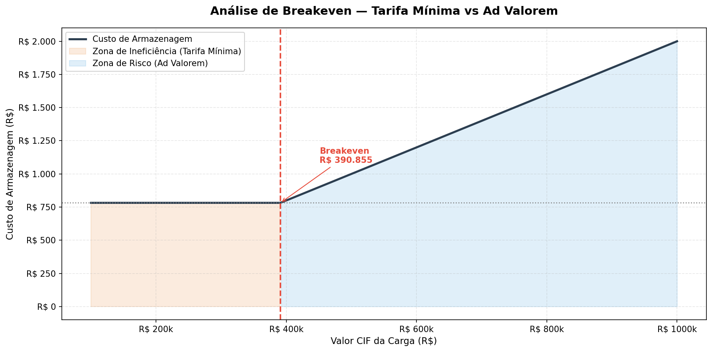
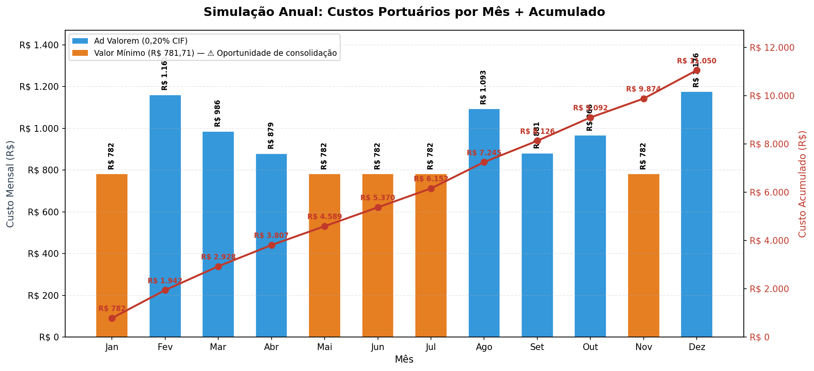
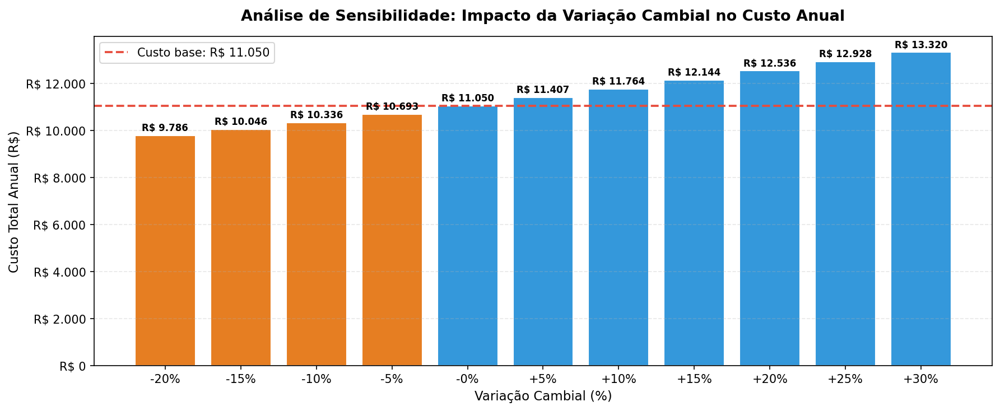

#  Análise de Custos Portuários — Porto de Santos

> **Ferramenta de simulação e análise de viabilidade para custos de armazenagem portuária, focada na identificação de gargalos financeiros em operações de Importação.**

---

##  O Problema de Negócio

Em operações de comércio exterior, a **previsibilidade de custos é um dos maiores desafios** enfrentados por importadores. A complexidade das tarifas portuárias — que misturam valores fixos e percentuais — dificulta saber com antecedência o custo real de armazenagem de uma carga.

A regra tarifária do Porto de Santos para container 40' segue a lógica:

$$\text{Custo} = \max(\text{R\$ 781,71},\ \text{Valor CIF} \times 0{,}20\%)$$

Isso cria três "dores" reais para o importador:

- **Falta de transparência:** operadores logísticos oferecem apenas simulações caso a caso, sem tabelas claras
- **Custos ocultos:** a cláusula de valor mínimo penaliza cargas de baixo valor agregado com taxas efetivas superiores a 0,20%
- **Decisões reativas:** sem visibilidade antecipada, o importador não consegue consolidar cargas ou planejar hedge cambial

**Objetivo:** Criar um algoritmo que automatize a decisão tarifária e gere visualizações estratégicas para suporte à decisão (*Data-Driven Decision Making*).

---

##  Principais Insights

### 1. Ponto de Breakeven — R$ 390.855



O algoritmo identifica matematicamente o momento exato em que a cobrança muda de regime:

| Zona | Valor CIF | Taxa Efetiva | Implicação |
|---|---|---|---|
| 🟠 Ineficiência | < R$ 390.855 | > 0,20% | Importador paga proporcionalmente mais |
| 🟢 Proporcional | > R$ 390.855 | = 0,20% | Custo justo e previsível |

### 2. Simulação Anual — Onde Estão os Gargalos?



Na simulação de um ano fiscal, **entre 4 e 6 meses ativaram a tarifa mínima** (barras laranjas). Cada mês laranja é uma **oportunidade concreta de consolidação de carga** — combinar duas cargas menores em um único container para diluir o custo fixo.

### 3. Análise de Sensibilidade Cambial



Um aumento de 10% no dólar não impacta linearmente o custo. Cargas próximas ao breakeven sofrem um **salto de custo mais abrupto** — o que reforça a necessidade de monitoramento cambial como parte da estratégia logística.

---

##  Recomendações Estratégicas

| Perfil do Importador | Recomendação |
|---|---|
| Carga CIF < R$ 390k | Consolidar cargas para diluir o custo fixo |
| Carga CIF > R$ 390k | Monitorar variação cambial — considerar hedge |
| Alta frequência de importação | Negociar tabela diferenciada com o operador portuário |

---

## ⚙️ Solução Técnica

### Conceitos Aplicados

- **Threshold Analysis:** Determinação algorítmica do ponto de mudança de regime tarifário
- **Mock Data Generation:** Dados sintéticos com distribuição controlada para validar o modelo financeiro
- **Sensitivity Analysis:** Impacto de variações cambiais no custo total anual
- **Visual Storytelling:** Dual-Axis Charts para correlacionar custos pontuais com tendências acumuladas

### Stack


---

## Estrutura do Projeto

```
analise-custos-portuarios/
├── 📁 input/                  ← dados e tabelas tarifárias
├── 📁 notebooks/
│   └── analise_custos_portuarios.ipynb  ← análise completa com gráficos
├── 📁 reports/
│   └── images/                ← gráficos gerados pelo notebook
├── 📁 src/
│   ├── __init__.py
│   ├── analise_custos.py      ← script principal
│   └── simulation_utils.py    ← funções reutilizáveis
├── .gitignore
├── requirements.txt
├── setup.py
└── README.md
```

---

##  Como Rodar Localmente

**Pré-requisitos:** Python 3.8+, Git

```bash
# Clone o repositório
git clone https://github.com/gbcarvalhoo/analise-custos-portuarios
cd analise-custos-portuarios

# Crie e ative um ambiente virtual
python -m venv venv
source venv/bin/activate  # Windows: venv\Scripts\activate

# Instale as dependências
pip install -r requirements.txt

# Abra o notebook
jupyter notebook notebooks/analise_custos_portuarios.ipynb
```

---

## 👤 Autor

**Gabriel Carvalho**
[github.com/gbcarvalhoo](https://github.com/gbcarvalhoo)
